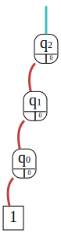

[](https://travis-ci.com/iic-jku/qfr)
[](https://codecov.io/gh/iic-jku/qfr)
[](https://opensource.org/licenses/MIT)
[](https://github.com/iic-jku/jkq)


# JKQ QFR - A JKQ Library for Quantum Functionality Representation Written in C++

A JKQ library for the representation of quantum functionality by the [Institute for Integrated Circuits](http://iic.jku.at/eda/) at the [Johannes Kepler University Linz](https://jku.at). This package is part of the [JKQ toolset](https://github.com/iic-jku/jkq).

Developers: Lukas Burgholzer, Hartwig Bauer, Stefan Hillmich and Robert Wille.

If you have any questions feel free to contact us using [iic-quantum@jku.at](mailto:iic-quantum@jku.at) or by creating an issue on [GitHub](https://github.com/iic-jku/qfr/issues).

## Usage

The package can be used for a multitude of tasks, as illustrated in the following:
* **Obtaining intermediate representations from circuit descriptions.** 
  
    Currently available file formats are:
      
  * `Real` (e.g. from [RevLib](http://revlib.org))
  * `OpenQASM` (e.g. used by [Qiskit](https://github.com/Qiskit/qiskit))
  * `GRCS` Google Random Circuit Sampling Benchmarks (see [GRCS](https://github.com/sboixo/GRCS))
  * `TFC` (e.g. from [Reversible Logic Synthesis Benchmarks Page](http://webhome.cs.uvic.ca/~dmaslov/mach-read.html))
  * `QC` (e.g. from [Feynman](https://github.com/meamy/feynman))
      
  Importing a circuit from a file in either of those formats is done via:
  ```c++
  std::string filename = "PATH_TO_FILE";
  qc::QuantumComputation qc(filename);
  ```
  or by calling
  ```c++
  qc.import(filename);
  ```  
  which first resets the `qc` object before importing the new file.

   
* **Generating circuit representations for important quantum algorithms.** 

    Currently available algorithms are:
    * Entanglement
    
        ```c++
      unsigned short n = 2;
      qc::Entanglement entanglement(n); // generates bell circuit
      ```
    
      Generates the circuit for preparing an *n* qubit GHZ state. Primarily used as a simple test case. 
    
    * Bernstein-Vazirani
        ```c++
      unsigned long long hiddenInteger = 16777215ull;
      qc::BernsteinVazirani bv(hiddenInteger); // generates Bernstein-Vazirani circuit for given hiddenInteger
         ```
    
        Generates the circuit for the Berstein-Vazirani algorithm using the provided *hiddenInteger*
    
    * Quantum Fourier Transform (QFT)
  
        ```c++
      unsigned short n = 3;
      qc::QFT qft(n); // generates the QFT circuit for n qubits
      ```
  
        Generates the circuit for the *n* qubit Quantum Fourier Transform.
  * Grover's search algorithm
  
       ```c++
      unsigned short n = 2;
      qc::Grover grover(n); // generates Grover's algorithm for a random n-bit oracle
      ```
    
       The algorithm performs ~ &#960;/4 &#8730;2&#8319; Grover iterations. An optional `unsigned int` parameter controls the *seed* of the random number generation for the oracle generation. 
   
* **Constructing a functional representation of a given quantum computation.**
 
    Thereby we use [our decision diagram (DD) package](https://github.com/iic-jku/dd_package.git), which is included as a git-submodule in this project, in order to construct a DD representation from the individual gate descriptions. 

    For more information on decision diagrams for quantum computing, please visit [iic.jku.at/eda/research/quantum_dd](http://iic.jku.at/eda/research/quantum_dd).
    
    The following example shows how to construct the functionality of the three-qubit QFT from above.
    
    ```c++
    auto dd = make_unique<dd::Package>(); // create an instance of the DD package
    auto functionality = qft.buildFunctionality(dd);  // obtain DD representation
  ``` 
  The matrix representation of the constructed functionality can be printed by calling
  ```c++
  qft.printMatrix(dd, functionality, std::cout);
  ```
  which results in the following output
  ```commandline
  Common Factor: √½ ½
         1	       1	       1	       1	       1	       1	       1	       1	
         1	       1	       1	       1	      -1	      -1	      -1	      -1	
         1	       1	      -1	      -1	      +i	      +i	      -i	      -i	
         1	       1	      -1	      -1	      -i	      -i	      +i	      +i	
         1	      -1	      +i	      -i	       √½(1+i)	      -√½(1+i)	      -√½(1-i)	       √½(1-i)	
         1	      -1	      +i	      -i	      -√½(1+i)	       √½(1+i)	       √½(1-i)	      -√½(1-i)	
         1	      -1	      -i	      +i	      -√½(1-i)	       √½(1-i)	       √½(1+i)	      -√½(1+i)	
         1	      -1	      -i	      +i	       √½(1-i)	      -√½(1-i)	      -√½(1+i)	       √½(1+i)	
  ```
  Note that matrix output factors in initial assignments as well as output permutations of the system (i.e. `initialLayout` and `permutation`). 
  
  The (much more compact) DD representation that was actually constructed can be visualized as a *\*.dot* file (which is automatically converted to SVG if GraphViz is installed) by calling
  ```c++
  dd::export2Dot(functionality, "functionality.dot");
  ```
  which produces
  
  
  
  See below for a description of the visualization options and their interpretation.
  
* **Basic support for DD-based simulation of quantum algorithms.**
 
    Only the calculation of a DD state vector representation is supported (without intermediate measurements). For a more powerful approach, see our dedicated simulator [JKQ DDSIM](http://iic.jku.at/eda/research/quantum_simulation/).

    The following example shows the simulation of Grover's algorithm from above (searching for the 2-bit string `00`). Note that `00` is just an example here, as the oracle that is generated by `Grover(n)` depends on a random seed.
    
    ```c++
    auto dd = make_unique<dd::Package>(); // create an instance of the DD package
    auto initial_state = dd->makeZeroState(n); // create initial state |0...0>
    auto state_vector = grover.simulate(initial_state, dd);
  ```
  
    The vector representation of the resulting state vector can be printed by calling
    ```c++
    grover.printVector(dd, state_vector, std::cout);
  ```
  which results in the following output
  ```commandline
  Common Factor: -1
    0: 1
    1: 0
   10: 0
   11: 0
  100: 0
  101: 0
  110: 0
  111: 0
  ```
    As expected, the probabilities for obtaining the state `|x00>` (the ancillary qubit *x* is ignored) sum up to *1*.
    
    The (much more compact) DD representation, that was actually produced by the simulation, can again be visualized as SVG file by calling
   ```c++
   dd::export2Dot(state_vector, "state_vector.dot", true);
   ```
                                                                                               
  which produces
  
  
    
* **Visualization and output of functional representations.**

    Quantum computations can be visualized by printing them to any given output stream, e.g. 
    
    ```c++
    std::cout << grover << std::endl;
  ``` 
  yields
  ```commandline
     i: 		0	1	2	
     1: 	X   	|	|	X 	
     2: 	H   	H 	|	|	
     3: 	H   	|	H 	|	
     4: 	Z   	c	c	Z 	
     5: 	H   	H 	|	|	
     6: 	H   	|	H 	|	
     7: 	X   	X 	|	|	
     8: 	X   	|	X 	|	
     9: 	H   	|	H 	|	
    10: 	X   	c	X 	|	
    11: 	H   	|	H 	|	
    12: 	X   	|	X 	|	
    13: 	X   	X 	|	|	
    14: 	H   	|	H 	|	
    15: 	H   	H 	|	|
    16: 	X   	|	|	X 	
     o: 		0	1	2	
    ```

    As already demonstrated above, the function `dd::exportDD(...)` can be used to create visualizations of DDs representing vectors as well as matrices. To this end, the thickness of each edge indicates the edge weight's magnitude, while a color code indicates its phase. We use the HSV color wheel (at 50% lightness and 50% saturation) given below
  
  
  
  Furthermore, the export function has several options to tune the look and feel of the resulting DDs, e.g., **enabling**/disabling color, enabling/**disabling** edge weights, enabling/**disabling** classic mode. 

 If you ever want to visually explore how decision diagrams are employed in quantum computing for tasks such as simulation and verification, check out our installation-free web-tool [JKQ DDVis](https://iic.jku.at/eda/research/quantum_dd/tool/).
   
  The library also supports the output of circuits in various formats by calling
    
  ```c++
  std::string filename = "PATH_TO_DESTINATION_FILE.{qasm | py}";
  qc.dump(filename);
  ```
  
  Currently available file formats are:
        
    * `OpenQASM` (.qasm)
    * `Qiskit` (.py) Qiskit export generates a python file, which can be used to transpile a respective circuit to a suitable architecture using the Qiskit toolset (specifically Qiskit Terra 0.12.0).
  
* **Circuit transcription**

    The project also includes a small command line application `qfr_app` which can be used to transcribe circuits from one format into another format, e.g.
    
    ```commandline
    qfr_app circuit.real circuit.py
    ```
    can be used to transcribe a circuit from `real` format to a Qiskit realization

### System Requirements

Building (and running) is continuously tested under Linux (Ubuntu 20.04) using gcc-9.3, gcc-10 and clang-11, MacOS (Catalina 10.15) using AppleClang and gcc-10, and Windows using MSVC 15.9. 
However, the implementation should be compatible with any current C++ compiler supporting C++14 and a minimum CMake version of 3.10.

It is recommended (although not required) to have [GraphViz](https://www.graphviz.org) installed for visualization purposes.

### Configure, Build, and Install

In order to build the library execute the following in the project's main directory
1) Configure CMake
    ```commandline
    cmake -S . -B build -DCMAKE_BUILD_TYPE=Release
    ```
   Windows users using Visual Studio and the MSVC compiler may try
   ```commandline
   cmake -S . -B build -G "Visual Studio 15 2017" -A x64 -DCMAKE_BUILD_TYPE=Release
   ```
   Older CMake versions not supporting the above syntax (< 3.13) may be used with
   ```commandline
   mkdir build && cd build
   cmake .. -DCMAKE_BUILD_TYPE=Release
   ```
2) Build the respective target. 
    ```commandline
   cmake --build ./build --config Release --target <target>
   ```
    The following CMake targets are available
    - `qfr`: The standalone library
    - `qfr_example`: A small commandline demo example (*.dot files will be created in the working directory which will be automatically converted to SVG if GraphViz is installed)
    - `qfr_app`: The commandline transcription executable
    - `qfr_test`: Unit tests using GoogleTest

3) Optional: The QFR library and app may be installed on the system by executing
   
    ```commandline
    cmake --build ./build --config Release --target install
    ```

    It can then also be included in other projects using the following CMake snippet
    
    ```cmake
    find_package(qfr)
    target_link_libraries(${TARGET_NAME} PRIVATE JKQ::qfr)
    ```
