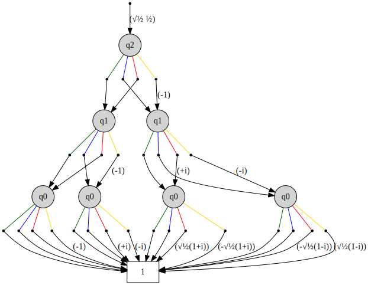
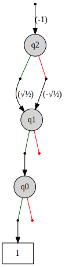

# A Library for Quantum Functionality Representation (QFR) Written in C++

A library for the representation of quantum functionality by the [Institute for Integrated Circuits](http://iic.jku.at/eda/) at the [Johannes Kepler University Linz](https://jku.at).

Developers: Lukas Burgholzer, Stefan Hillmich, Hartwig Bauer and Robert Wille.

If you have any questions feel free to contact us using [iic_quantum@jku.at](mailto:iic_quantum@jku.at) or opening an issue.

## Usage

The package can be used for a multitude of tasks, as illustrated in the following:
* **Obtaining intermediate representations from circuit descriptions.** 
  
    Currently available file formats are:
      
  * `Real` (e.g. from [RevLib](http://revlib.org))
  * `OpenQASM` (e.g. used by [Qiskit](https://github.com/Qiskit/qiskit))
  * `GRCS` Google Random Circuit Sampling Benchmarks (see [GRCS](https://github.com/sboixo/GRCS))
      
  ```c++
      std::string filename = "PATH_TO_FILE";
      qc::Format format = qc::{ Real | OpenQASM | GRCS };
      qc::QuantumComputation qc;
      qc.import(filename, format);
  ```
  

   
* **Generating circuit representations for important quantum algorithms.** 

    Currently available algorithms are:
    * Quantum Fourier Transform (QFT)
  
        ```c++
      unsigned short n = 3;
      qc::QFT qft(n); // generates the QFT circuit for n qubits
      ```
  
      An optional `bool` parameter controls whether *SWAP* operations at the end are included in the computation or not (default: `false`). In the case that no SWAPs are included, the consequently reversed order of amplitudes is additionally stored in the representation's `outputPermutation`.
  * Grover's search algorithm
  
       ```c++
          unsigned short n = 2;
          qc::Grover grover(n); // generates Grover's algorithm for a random n-bit oracle
      ```
    
       The algorithm performs ~ &#960;/4 &#8730;2&#8319; Grover iterations. An optional `unsigned int` parameter controls the *seed* of the random number generation for the oracle generation. 
   
* **Constructing a functional representation of a given quantum computation.**
 
    Thereby we use [our decision diagram (DD) package](https://github.com/iic-jku/dd_package.git), which is included as a git-submodule in this project, in order to construct a DD representation from the individual gate descriptions. 

    For more information on decision diagrams for quantum computing, please visit [iic.jku.at/eda/research/quantum_dd](http://iic.jku.at/eda/research/quantum_dd).
    
    The following example shows how to construct the functionality of the three-qubit QFT from above.
    
    ```c++
    auto dd = make_unique<dd::Package>(); // create an instance of the DD package
    auto functionality = qft.buildFunctionality(dd);  // obtain DD representation
  ``` 
  The matrix representation of the constructed functionality can be printed by calling
  ```c++
  qft.printMatrix(dd, functionality);
  ```
  which results in the following output
  ```commandline
  Common Factor: √½ ½
         1	       1	       1	       1	       1	       1	       1	       1	
         1	       1	       1	       1	      -1	      -1	      -1	      -1	
         1	       1	      -1	      -1	      +i	      +i	      -i	      -i	
         1	       1	      -1	      -1	      -i	      -i	      +i	      +i	
         1	      -1	      +i	      -i	       √½(1+i)	      -√½(1+i)	      -√½(1-i)	       √½(1-i)	
         1	      -1	      +i	      -i	      -√½(1+i)	       √½(1+i)	       √½(1-i)	      -√½(1-i)	
         1	      -1	      -i	      +i	      -√½(1-i)	       √½(1-i)	       √½(1+i)	      -√½(1+i)	
         1	      -1	      -i	      +i	       √½(1-i)	      -√½(1-i)	      -√½(1+i)	       √½(1+i)	
  ```
  Note that matrix output factors in permutations of the input/output qubits (i.e. `inputPermutation` and `outputPermutation`). 
  
  The (much more compact) DD representation that was actually constructed can be visualized as a *\*.dot* file (which is automatically converted to SVG if GraphViz is installed) by calling
  ```c++
  dd->export2Dot(functionality, "functionality.dot");
  ```
  which produces
  
  
  
* **Basic support for DD-based simulation of quantum algorithms.**
 
    Only the calculation of a DD state vector representation is supported (without intermediate measurements). For a more powerful approach, see our dedicated [DD-based simulator](http://iic.jku.at/eda/research/quantum_simulation/).

    The following example shows the simulation of Grover's algorithm from above (searching for the 2-bit string `00`)
    
    ```c++
    auto dd = make_unique<dd::Package>(); // create an instance of the DD package
    auto initial_state = dd->makeZeroState(n); // create initial state |0...0>
    auto state_vector = grover.simulate(initial_state, dd);
  ```
  
    The vector representation of the resulting state vector can be printed by calling
    ```c++
    grover.printVector(dd, state_vector);
  ```
  which results in the following output
  ```commandline
  Common Factor: -1
    0: √½
    1: 0
   10: 0
   11: 0
  100: -√½
  101: 0
  110: 0
  111: 0
  ```
    As expected, the probabilities for obtaining the state `|x00>` (the ancillary qubit *x* is ignored) sum up to *1*.
    
    The (much more compact) DD representation, that was actually produced by the simulation, can again be visualized as SVG file by calling
   ```c++
   dd->export2Dot(state_vector, "state_vector.dot", true);
   ```
                                                                                               
  which produces
  
  
  
* **Visualization and output of functional representations.**

    Quantum computations can be visualized by printing them to any given output stream, e.g. 
    
    ```c++
    std::cout << grover << std::endl;
  ``` 
  yields
  ```commandline
     i: 		0	1	2	
     1: X   	|	|	X 	
     2: H   	H 	|	|	
     3: H   	|	H 	|	
     4: H   	|	|	H 	
     5: X   	c	c	X 	
     6: H   	H 	|	|	
     7: H   	|	H 	|	
     8: X   	X 	|	|	
     9: X   	|	X 	|	
    10: H   	|	H 	|	
    11: X   	c	X 	|	
    12: H   	|	H 	|	
    13: X   	|	X 	|	
    14: X   	X 	|	|	
    15: H   	|	H 	|	
    16: H   	H 	|	|	
     o: 		0	1	2	
    ```

    It was already shown above how to visualize the constructed vectors and matrices, as well as the resulting decision diagrams.
    
    The library also supports the output of circuits in various formats by calling
    
  ```c++
  std::string filename = "PATH_TO_DESTINATION_FILE";
  qc::Format format = qc::{ Real | OpenQASM | GRCS };
  qc.dump(filename, format);
  ```

## System Requirements

Building and running have been tested under 
* macOS 10.15,
* Linux (Ubuntu 18.04, 64-bit),

using 
* gcc (7.4 and 9.1),
* AppleClang,

and 
* CMake 3.15.

However the implementation should be compatible with any modern compiler supporting C++14 and a minimum CMake Version of 3.10. 

It is recommended (although not required) to have [GraphViz](https://www.graphviz.org) installed for visualization purposes.

## Build and Run
To build the library and run a small demo, showcasing the library's features, execute the following (*.dot files will be created in the working directory which will be automatically converted to SVG if GraphViz is installed).

```commandline
mkdir build
cd build
cmake ..
cmake --build . --target QFR_example
cd test
./QFR_example
```

The repository also includes some (at the moment very basic) unit tests (using GoogleTest), which aim to ensure the correct behaviour of the library. They can be built and executed in the following way:
```commandline
cmake --build . --target GoogleTest
cd test
./GoogleTest
```
