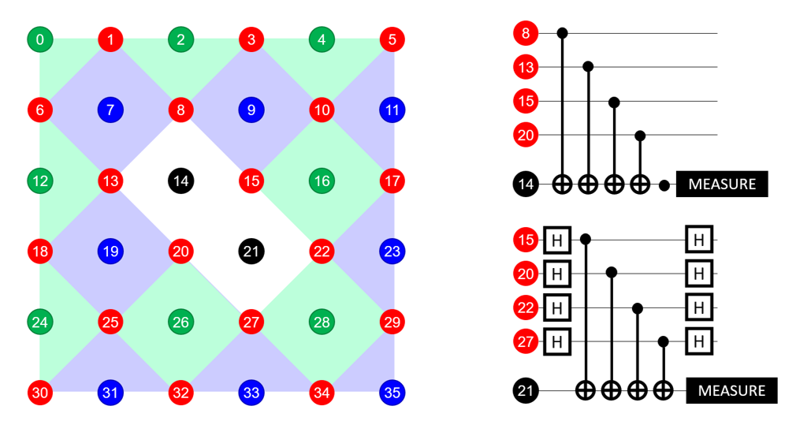

# Error-correcting codes

### Properties of the implemented error-correcting codes
|  | Q3Shor[^1] | Q5Laflamme[^2] | Q7Steane[^3] | Q9Shor[^1] | Q9Surface[^4] | Q18Surface |
| --- | --- | --- | --- | --- | --- | --- |
| able to detect bit flips | :heavy_check_mark: | :heavy_check_mark: | :heavy_check_mark: | :heavy_check_mark: | :heavy_check_mark: | :heavy_check_mark: |
| able to detect phase flips | :heavy_multiplication_x: | :heavy_check_mark: | :heavy_check_mark: | :heavy_check_mark: | :heavy_check_mark: | :heavy_check_mark: |
| #physical data qubits per logical qubit | 3 | 5 | 7 | 9 | 9 | 18 |
| #ancilla qubits (total) | 2 | 4 | 3 | 8 | 8 | 18 per qubit |
| #qubits for n logical qubits | 3n+2 | 5n+4 | 7n+3 | 9n+8 | 9n+8 | 36n |
| #classical bits (total) | 2 | 5 | 3 | 8 | 8 | 16 |

[^1]: [Scheme for reducing decoherence in quantum computer memory](https://link.aps.org/doi/10.1103/PhysRevA.52.R2493))
[^2]: [Perfect Quantum Error Correcting Code](https://link.aps.org/doi/10.1103/PhysRevLett.77.198)
[^3]: [Error Correcting Codes in Quantum Theory](https://journals.aps.org/prl/pdf/10.1103/PhysRevLett.77.793)
[^4]: [A proposal for a minimal surface code experiment](https://link.aps.org/doi/10.1103/PhysRevA.96.032338))

### Q18Surface
The Q18Surface code implemented here is based on the concept that unmeasured data qubits can be used to represent logical qubits, as described [here](https://journals.aps.org/pra/abstract/10.1103/PhysRevA.80.052312). The basic properties and operations are shown and described below: 

* red qubits = data qubits
* green/blue qubits = ancilla qubits - measure X-/Z-parity of data qubits in green/blue area, respectively
* black qubits = used as logical qubits
* examples
  * $X_L = X_{15}X_{17}$ (any set of operations that changes an even number of red data qubits in each green area, but triggers qubit 14)
  * $Z_L = Z_{18}Z_{20}$ (any set of operations that changes an even number of red data qubits in each blue area, but triggers qubit 21)
  * $H_L = H_{each red qubit}$, followed by mirroring along the axis $5-10-\ldots-30$, i.e. $swap(1,29), swap(3, 17), \ldots$
* to measure the bit or phase of the logical qubit, measurements are performed on the qubit 14 or 21, respectively, as shown in the right-hand corner of the picture. 
